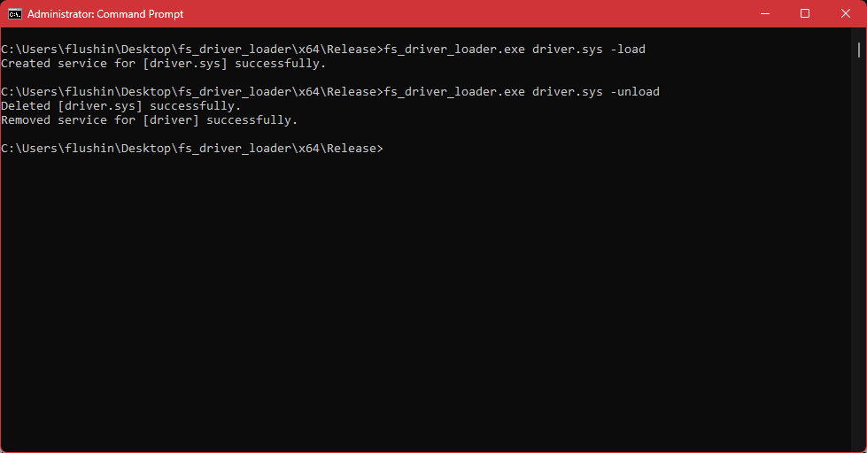

# fs_driver_loader
Load the driver during system boot by setting up a FSDriver service entry. Considering that FaceIT/Vanguard drivers are initialized as boot drivers and Windows loads FSDrivers befire boot drivers, which is why our driver will be loaded first.

## Procedure
1. The loader copies the targetted driver so system32\drivers
2. Service entry is created in the registry
   
## Example Usage


Note: this project requres your driver to be signed obviously<br />

## Usage

```fs_driver_loader.exe driver.sys -load/-unload```
